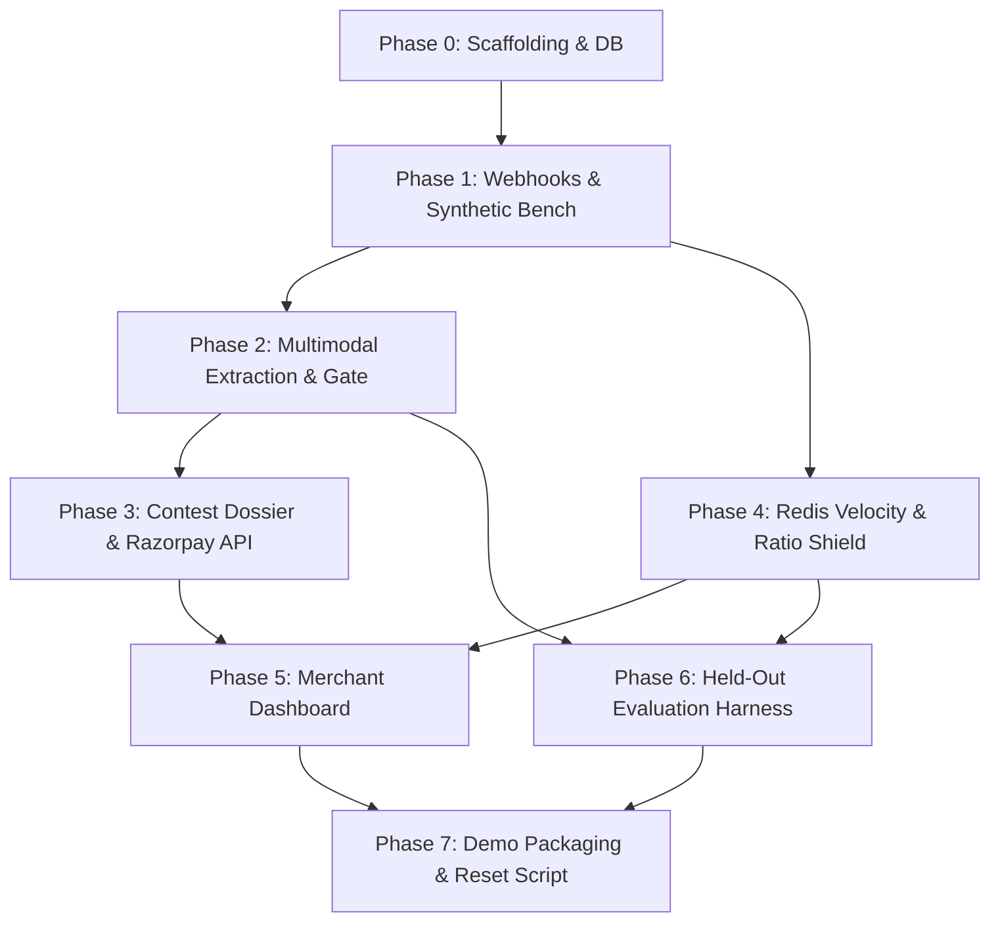

# RazorSentinel (AegisPay) — Implementation Plan

RazorSentinel is an autonomous fintech risk-management assistant for Razorpay merchants (Track 02: AI Risk Manager). It features two core cooperating engines:
1. **Multimodal Dispute Evidence Compiler**: Ingests courier AWB scans, proof-of-delivery (POD) signatures, and customer support chats; uses Gemini 3 Flash to extract structured evidence and compute a `completeness_score`; automatically gates submissions between autonomous `/v1/disputes/{id}/contest` submission ($\ge 0.80$) and merchant draft review ($< 0.80$).
2. **Preemptive Velocity & Ratio Shield**: Employs an Upstash Redis sliding-window detector to flag card-testing micro-transactions and monitors rolling 30-day dispute ratios to prevent acquiring-bank settlement cliffs.

This plan details the phased execution strategy from Phase 0 to Phase 7, adhering to strict phase checkup gates.

---

## User Review Required

> [!IMPORTANT]
> **Execution Strategy**: We will execute the phases sequentially. Each phase will undergo strict, independent verification checks (automated tests, CLI sanity checks, log verification) before proceeding to the next.
> 
> **Environment Variables**: To run live API calls against Razorpay, Gemini, Upstash Redis, and Supabase, you can supply your credentials in `.env` (a `.env.example` template will be generated in Phase 0). Mock/offline test modes with unit test fixtures will be provided for all integration points so development and evaluation can proceed seamlessly.

---

## Proposed Phases & Milestones

---

### Phase 0: Scaffolding & Environment Setup
- **Goal**: Establish the Python 3.11+ FastAPI skeleton, environment configuration, database migration scripts, and Supabase client.
- **Components & Files**:
  - `[NEW]` [app/main.py](file:///c:/Users/realr/OneDrive/Desktop/Razor/app/main.py): FastAPI app with `/health` endpoint returning `{"status": "ok", "version": "1.0.0"}`.
  - `[NEW]` [app/config.py](file:///c:/Users/realr/OneDrive/Desktop/Razor/app/config.py): Pydantic settings loading environment variables.
  - `[NEW]` [.env.example](file:///c:/Users/realr/OneDrive/Desktop/Razor/.env.example): Complete template for Razorpay, Gemini, Upstash, and Supabase keys.
  - `[NEW]` [requirements.txt](file:///c:/Users/realr/OneDrive/Desktop/Razor/requirements.txt): Core dependencies (`fastapi`, `uvicorn`, `httpx`, `pydantic`, `pydantic-settings`, `python-dotenv`, `google-generativeai`, `upstash-redis`, `supabase`, `reportlab`, `weasyprint`, `pytest`, `pytest-asyncio`, `pillow`).
  - `[NEW]` [app/db/migrations/0001_init.sql](file:///c:/Users/realr/OneDrive/Desktop/Razor/app/db/migrations/0001_init.sql): Schema for `disputes`, `risk_velocity_logs`, and `successful_orders`.
  - `[NEW]` [app/db/client.py](file:///c:/Users/realr/OneDrive/Desktop/Razor/app/db/client.py): Supabase client initialization helper with error checking.
  - `[NEW]` [tests/test_db_client.py](file:///c:/Users/realr/OneDrive/Desktop/Razor/tests/test_db_client.py): Test verifying clear exceptions when credentials are missing.
- **Phase 0 Checkup**:
  - Confirm FastAPI server starts and `GET /health` returns 200 OK with expected JSON.
  - Run `pytest tests/test_db_client.py -v`.
  - Verify SQL migration matches Section 7 of specification.

---

### Phase 1: Synthetic Test Bench & Webhook Ingestion
- **Goal**: Ingest and cryptographically verify Razorpay webhooks, and generate a 150-scenario multimodal synthetic test bench (`clean`, `partial`, `adversarial`).
- **Components & Files**:
  - `[NEW]` [app/webhooks/razorpay.py](file:///c:/Users/realr/OneDrive/Desktop/Razor/app/webhooks/razorpay.py): HMAC-SHA256 signature verification over raw request body; routes `payment.dispute.created`, `payment.failed`, and `order.paid`.
  - `[NEW]` [tests/test_webhook_signature.py](file:///c:/Users/realr/OneDrive/Desktop/Razor/tests/test_webhook_signature.py): Tests for valid signature, invalid signature (401), missing signature (401), and unhandled events (200 without routing).
  - `[NEW]` [scripts/generate_synthetic_bench.py](file:///c:/Users/realr/OneDrive/Desktop/Razor/scripts/generate_synthetic_bench.py): Generates 150 scenarios (50 clean, 50 partial, 50 adversarial) with synthetic AWB image rendering (Pillow), POD signatures, CRM chat transcripts, and ground-truth `manifest.json`.
- **Phase 1 Checkup**:
  - Run webhook signature test suite.
  - Verify `data/synthetic/clean`, `data/synthetic/partial`, and `data/synthetic/adversarial` each contain 50 scenarios with valid images and manifests.

---

### Phase 2: Evidence Extraction Pipeline & Completeness Gate
- **Goal**: Multimodal evidence extraction using Gemini 3 Flash structured outputs with honesty prompting and automated completeness scoring threshold gating.
- **Components & Files**:
  - `[NEW]` [app/schemas/dispute.py](file:///c:/Users/realr/OneDrive/Desktop/Razor/app/schemas/dispute.py): `DisputeExtractionOutput` Pydantic model (`awb_number`, `recipient_name`, `delivery_status`, `delivery_timestamp`, `pod_signature_verified`, `customer_chat_admission`, `contradiction_quote`, `completeness_score`, `legal_summary`).
  - `[NEW]` [app/engines/evidence/extract.py](file:///c:/Users/realr/OneDrive/Desktop/Razor/app/engines/evidence/extract.py): Multimodal reasoning call with Gemini 3 Flash, exponential backoff retries, and strict schema validation.
  - `[NEW]` [app/engines/evidence/gate.py](file:///c:/Users/realr/OneDrive/Desktop/Razor/app/engines/evidence/gate.py): Gating function deciding `"auto_submit"` ($\ge 0.80$) vs `"draft_for_human_review"` ($< 0.80$).
  - `[NEW]` [tests/test_gate.py](file:///c:/Users/realr/OneDrive/Desktop/Razor/tests/test_gate.py): Boundary unit tests for 0.79, 0.80, and 0.81 scores.
- **Phase 2 Checkup**:
  - Run extraction on sample synthetic files; confirm adversarial degraded files receive lower completeness scores.
  - Run `pytest tests/test_gate.py -v`.

---

### Phase 3: Contest Submission Engine & Dossier Compilation
- **Goal**: Generate court-ready PDF dossiers and integrate with Razorpay Documents and Dispute Contest APIs with proper `action="submit"` vs `action="draft"` handling.
- **Components & Files**:
  - `[NEW]` [app/engines/evidence/dossier.py](file:///c:/Users/realr/OneDrive/Desktop/Razor/app/engines/evidence/dossier.py): Generates structured 1-page evidence dossier PDF (`data/dossiers/{dispute_id}.pdf`) displaying AWB, POD status, chat admissions, legal summary, and visible completeness score badge.
  - `[NEW]` [app/engines/evidence/submit.py](file:///c:/Users/realr/OneDrive/Desktop/Razor/app/engines/evidence/submit.py): Implements `upload_evidence_document()` (`POST /v1/documents`) and `contest_dispute()` (`PATCH /v1/disputes/{id}/contest`), persisting errors to `last_error`.
  - `[NEW]` [tests/test_submission_engine.py](file:///c:/Users/realr/OneDrive/Desktop/Razor/tests/test_submission_engine.py): Unit and integration tests with mocked and test-mode Razorpay endpoints.
- **Phase 3 Checkup**:
  - Verify PDF generation cleanly renders all metadata and completeness badge.
  - Verify `action="draft"` is sent for human review cases and `action="submit"` for auto-submit cases.

---

### Phase 4: Velocity & Ratio Shield
- **Goal**: Sliding-window Redis detector for micro-transaction bot attacks and a rolling 30-day dispute-to-turnover ratio monitor.
- **Components & Files**:
  - `[NEW]` [app/engines/velocity/shield.py](file:///c:/Users/realr/OneDrive/Desktop/Razor/app/engines/velocity/shield.py): Sliding-window micro-transaction velocity evaluation using Upstash Redis (`ALLOW`, `FLAG_FOR_REVIEW`, `CHALLENGE_STEP_UP_OTP`).
  - `[NEW]` [app/engines/velocity/ratio_monitor.py](file:///c:/Users/realr/OneDrive/Desktop/Razor/app/engines/velocity/ratio_monitor.py): Rolling 30-day dispute ratio computation (`safe` $<0.30\%$, `watch` $0.30-0.45\%$, `danger` $\ge 0.45\%$) as a read-only monitoring engine.
  - `[NEW]` [tests/test_velocity.py](file:///c:/Users/realr/OneDrive/Desktop/Razor/tests/test_velocity.py): Burst simulation tests validating threshold transitions at 3rd, 5th, and 11th requests.
- **Phase 4 Checkup**:
  - Run `pytest tests/test_velocity.py -v`.
  - Verify zero mutating Razorpay calls exist in the velocity shield engine (strictly read/alert only).

---

### Phase 5: Merchant Dashboard
- **Goal**: High-aesthetic Next.js 14 + Tailwind CSS dashboard providing real-time visibility into dispute operations, ratio health gauge, and velocity logs.
- **Components & Files**:
  - `[NEW]` [app/api/routes.py](file:///c:/Users/realr/OneDrive/Desktop/Razor/app/api/routes.py): API endpoints (`GET /api/disputes`, `GET /api/velocity/ratio`, `GET /api/velocity/logs`).
  - `[NEW]` [dashboard/](file:///c:/Users/realr/OneDrive/Desktop/Razor/dashboard): Next.js application with 3 live views:
    1. **Dispute Feed**: Live dispute table with status, completeness scores, auto-submit badges, and dossier PDF previews.
    2. **Health Gauge**: 30-day rolling dispute ratio gauge with threshold indicators (`safe` / `watch` / `danger`).
    3. **Bot-Attack Log**: Real-time stream of flagged/challenged micro-transactions.
- **Phase 5 Checkup**:
  - Verify empty/error states when API is unreachable.
  - Verify real DB records populate cleanly on refresh.

---

### Phase 6: Held-Out Evaluation Harness (Track 02 Core Focus)
- **Goal**: Comprehensive, honest benchmarking script testing the complete pipeline against all 150 synthetic scenarios to compute empirical metrics.
- **Components & Files**:
  - `[NEW]` [scripts/evaluate_risk.py](file:///c:/Users/realr/OneDrive/Desktop/Razor/scripts/evaluate_risk.py): Runs full pipeline across `clean`, `partial`, and `adversarial` datasets; outputs confusion matrices and `results.json` covering:
    - AWB & POD OCR precision/recall.
    - Chat contradiction recall.
    - Card-testing interception rate.
    - False-positive checkout friction rate.
    - Net Financial Impact calculation.
- **Phase 6 Checkup**:
  - Run `python scripts/evaluate_risk.py` and inspect `results.json` breakdowns per tier.

---

### Phase 7: Demo Packaging & Reset Script
- **Goal**: Deterministic demo runner and documentation for live presentations.
- **Components & Files**:
  - `[NEW]` [scripts/demo_reset.py](file:///c:/Users/realr/OneDrive/Desktop/Razor/scripts/demo_reset.py): Idempotent database reset seeding 3 canonical demo scenarios (clean auto-submit, partial draft-for-review, blocked card-testing burst).
  - `[NEW]` [docs/DEMO_SCRIPT.md](file:///c:/Users/realr/OneDrive/Desktop/Razor/docs/DEMO_SCRIPT.md): Step-by-step click-and-run presentation walkthrough.
- **Phase 7 Checkup**:
  - Execute `demo_reset.py` multiple times and verify idempotent state initialization.

---

## Verification Plan

### Automated Tests
- `pytest tests/ -v`: Comprehensive unit and integration test suite covering DB clients, webhook HMAC verification, completeness gating, and Redis velocity shielding.
- `python scripts/evaluate_risk.py`: End-to-end evaluation harness across all 150 test bench cases.

### Manual Verification
- Live FastAPI startup: `uvicorn app.main:app --reload` tested via `curl http://localhost:8000/health`.
- Live Dashboard review in browser with dark fintech aesthetic, live metrics, and PDF preview modals.
