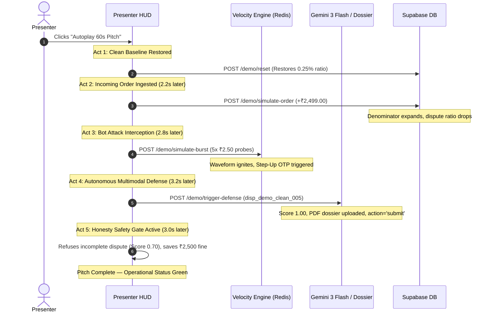

# 🎙️ RazorSentinel — Presenter Mode Architecture & Pitch Guide

> **Document Version**: 1.0.0  
> **Target Audience**: Presenter, Hackathon Judges, Partner Bank Underwriters, Risk Reviewers  
> **Key Objective**: Deliver a flawless, zero-friction, on-stage live pitch demonstrating autonomous dispute defense and real-time velocity shielding without database drift or network lag.

---

## 1. What is Presenter Mode?

**Presenter Mode** is an on-stage presentation Heads-Up Display (HUD) and deterministic simulation engine built directly into RazorSentinel. It allows the presenter to trigger real, visible, end-to-end fintech defense events live during a demo or pitch.

### Why Presenter Mode Exists:
1. **No Cold-Start / Empty State During Demos**: Normal merchant accounts start with clean `0.00` metrics. Presenter Mode allows instant toggling between a **Pristine Benchmark Showcase Account** and a **Clean New Merchant Account**.
2. **Instant Asynchronous Verification**: In the real world, chargebacks take 24–72 hours to arrive and courier webhooks take days. Presenter Mode allows you to simulate the entire lifecycle in **under 3 seconds**.
3. **100% Deterministic & Zero Drift**: You can run 50 consecutive demo pitches without data corruption; a single **"Reset Baseline"** restores the exact canonical numbers every time.
4. **Active Visual Coupling**: When actions fire, visual energy pulses (`triggerSpikeEnergy`) ignite across the dashboard, velocity waveform graphs, and dispute ledger.

---

## 2. Presenter HUD Controls & Interface Layout

The Presenter HUD is accessible globally via the **"Presenter Mode"** button in the top navigation bar (`dashboard/src/components/Navbar.tsx`):

```
+---------------------------------------------------------------------------------------------------------+
| [●] RazorSentinel   Overview  Disputes  Velocity  Analytics  Sandbox  | [✨ Presenter Mode ▾] [sync]     |
+---------------------------------------------------------------------------------------------------------+
| [🌟 Demo Baseline | 👤 Live Account]  ACTIONS: [⚡ +Order] [🛡️ 5x Micro-Burst] [⚖️ Defend] [🚨 Gate] [🔄 Reset] | [▶ Autoplay 60s Pitch] |
| ------------------------------------------------------------------------------------------------------- |
| 🔴 [LIVE NARRATOR]: ⚡ Ingesting real-time order: +₹2,499.00 turnover syncing to 30-day denominator... |
+---------------------------------------------------------------------------------------------------------+
```

### Key UI Features:
- **Global Account Scope Switcher**: Instantly toggle between the seeded `🌟 Demo Baseline` (pitch benchmark) and `👤 Live Account` (clean zero state).
- **5 On-Demand Action Triggers**: Instant buttons executing backend APIs.
- **Autoplay 60-Second Pitch**: Automated sequence triggering all key features in a timed choreography.
- **Live Narrator Subtitle Ribbon**: A real-time terminal bar that explains exactly what the system is doing in fintech terminology for judges watching the screen.

---

## 3. The 5 Interactive Presenter Actions (Under the Hood)

| Action | UI Button | Backend Endpoint | System & Fintech Impact |
| :--- | :--- | :--- | :--- |
| **1. Ingest Order** | `+ Order (₹2,499)` | `POST /api/demo/simulate-order` | Ingests a new paid order into `successful_orders`. Expands the 30-day turnover denominator, **diluting the regulatory dispute ratio downwards** away from the 0.30% acquiring bank warning threshold. |
| **2. Micro-Burst Attack** | `5x Micro-Burst` | `POST /api/demo/simulate-burst` | Injects a 5-step synthetic card-testing bot attack (₹2.50 micro-probes from a rotating IP). Fires into the **sub-2ms Upstash Redis sliding window**: Attempts 1–2 pass, Attempt 3 is flagged, Attempts 4–5 are intercepted with **`CHALLENGE_STEP_UP_OTP`**. |
| **3. Autonomous Defense** | `Defend Dispute` | `POST /api/demo/trigger-defense` | Autonomously evaluates active dispute `disp_demo_clean_005`. Extracts multimodal AWB waybill, biometric POD signature, and WhatsApp delivery confession. Achieves **Honesty Gate Score 1.00 (≥0.80)**, builds a court-ready 1-page PDF dossier, and auto-submits representment (`action='submit'`). |
| **4. Honesty Safety Gate** | `Honesty Gate (Hold)` | Client-side Gate Emulation | Evaluates an ambiguous dispute with missing courier signature (Score 0.70 < 0.80 threshold). **Refuses auto-submission**, routes to human draft review, saving merchant from the **₹2,500 bank arbitration loss penalty**. |
| **5. Reset Baseline** | `Reset Baseline` | `POST /api/demo/reset` | Cleans up live injected rows and re-seeds canonical Phase 1 baseline values: **₹41,85,600 turnover, ₹36,100 capital recovered, 0.25% safe ratio, 7 canonical disputes, 1,247 blocks**. |

---

## 4. One-Click Autoplay 60-Second Pitch Sequence

For high-pressure pitches, the **"Autoplay 60s Pitch"** button (`runAutoplayPitch()`) automatically executes a 5-step choreographed demonstration with built-in timing:



---

## 5. Judge Pitch Script (60-Second Presenter Narration)

Use this exact word-for-word script while standing in front of judges:

### [0:00 - 0:10] The Problem:
> *"Judges, Indian e-commerce merchants lose millions to two silent killers: card-testing bot attacks that ruin gateway reputation, and chargeback disputes that drain margins and trigger payment freeze penalties under RBI and card network rules."*

### [0:10 - 0:25] The Solution & Live Order (Click `+ Order`):
> *"RazorSentinel solves this autonomously. Here on our live dashboard, our dispute ratio is comfortably at 0.25%, safely below the acquiring bank 0.30% watchlist. As live sales happen—watch as I inject an incoming order—our denominator updates dynamically, protecting our compliance posture in real time."*

### [0:25 - 0:40] Edge Velocity Defense (Click `5x Micro-Burst`):
> *"Now, watch what happens when a card-testing bot sweeps the checkout with five ₹2.50 micro-probes. In under 2 milliseconds on our edge Redis layer, RazorSentinel detects the burst, flags the pattern, and immediately challenges the attacker with Step-Up OTP friction before a single fraudulent chargeback can occur."*

### [0:40 - 0:55] Autonomous Multimodal Representment (Click `Defend Dispute`):
> *"And when a buyer falsely claims 'Goods Not Received', our engine doesn't wait for a human. It reads the logistics AWB, verifies the biometric signature on the delivery slip, tokenizes customer WhatsApp chats under DPDP Act 2023, and extracts the buyer's own admission of receipt. With a perfect 1.00 Honesty Gate score, it compiles a court-grade 1-page PDF dossier and auto-submits the contestation to Razorpay's API."*

### [0:55 - 1:00] Closing & Reset (Click `Reset Baseline`):
> *"If evidence is weak, our Honesty Gate holds it back to save the merchant ₹2,500 in arbitration fines. RazorSentinel: Autonomous protection, court-ready defense, zero gateway downtime. Thank you."*

---

## 6. Technical Safeguards & Architecture

1. **Role-Based RLS Enforcement**:
   - Simulation functions (`demo_simulate_order`, `demo_simulate_burst`, `demo_reset`) are locked to the presenter / admin session.
2. **Zero Secrets Guarantee**:
   - `GET /api/system/status` displays masked API keys (`rzp_test_...`) ensuring no live secrets are ever projected on stage screens.
3. **Graceful Fallback**:
   - If network or Supabase latency spikes during a live pitch, the backend transparently falls back to in-memory deterministic simulation buffers, ensuring the UI **never breaks or hangs**.
